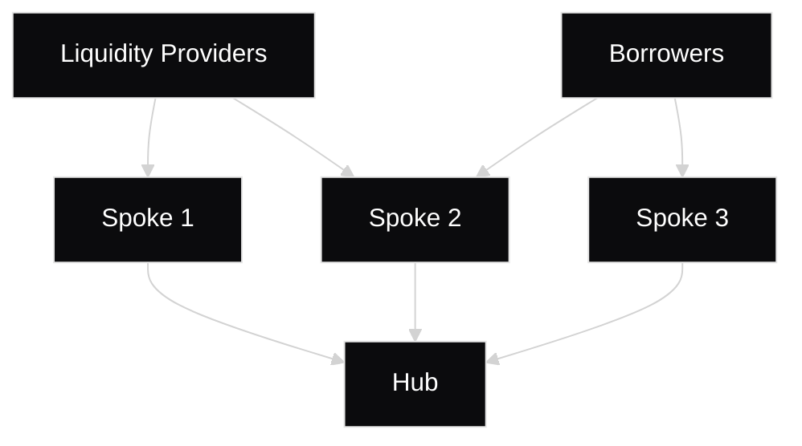

# Overview

Aave V4 introduces an architectural redesign centered around the Hub, enabling protocol flexibility and capital efficiency. This innovative architecture allows the Governor (e.g., the Aave DAO) to dynamically manage Spokes, adding new borrowing capabilities and removing outdated ones without requiring costly liquidity migrations.

The protocol implements sophisticated risk management through its Liquidity Premiums system, where each asset receives a dynamic risk factor (called Collateral Risk) ranging from 0 to 1000_00 (BPS) based on the asset's implied volatility, market conditions, liquidity, risk, etc. This granular pricing mechanism introduces base rates for high-quality collateral (such as ETH) while adjusting borrowing costs proportionally to Collateral Risk profiles.

By providing preferential rates for stronger collateral and optimizing capital efficiency, Aave V4 creates a more robust lending environment that accurately prices risk and rewards. Consequently, the protocol attracts higher-quality collateral, while offering improved yields for suppliers and lower fees for borrowers utilizing safer collateral assets.

# Hub and Spokes

Aave V4 introduces a hub-and-spoke model for liquidity management. The Hub coordinates liquidity, while Spokes handle asset-specific lending and borrowing.

Spokes are individual modules that can connect to one or more Hubs. They route user actions (supply/withdraw and borrow/repay) to the appropriate Hub based on reserve configuration and available caps. Whenever liquidity is restored on the Hub, Spokes have to pay a base interest (determined by an interest rate strategy at the Hub level) and a Risk Premium (determined by the collateral composition of the user that triggered the action).

A Hub can have an unspecified number of Spokes, each one contributing to the total outstanding debt and to the interest generated. The Hub manages the basic accounting (total liquidity vs available), the interest rates, and the draw and supply caps, among other parameters.

## Hub

The Hub is immutable and serves as the central coordinator for liquidity management in Aave V4. The design allows for multiple Hubs to exist, with each Hub maintaining oversight of its own set of Spokes. Each Hub sets the supply/borrow caps for its Spokes and enforces crucial accounting invariants. The design objective was to make the Hub as simple as possible.

The key aspects of the Hub include:

- Maintaining a registry of authorized Spokes for each supported asset.
- Setting liquidity caps to limit Spoke drawing and adding.
- Providing emergency stop functionality to halt operations, if needed.
- Enforcing accounting invariants:
  - Total borrowed assets <= total supplied assets
  - Total borrowed shares == total minted debt shares
  - Hub assets <= sum of Spoke assets (converted from shares)

## Spokes

The Spokes are upgradeable and the primary components responsible for facilitating lending and borrowing functionalities for specific assets within the Aave V4 ecosystem. They can register into Hubs and are allowed to draw (borrow) liquidity from them. The nature of the Spoke is not specific and can be anything: crypto-based, RWA-based, DEX-LPs-based, and so on.

Users interact with the Spokes, which then interact directly with the Hubs. The Spokes manage the following aspects:

- Triggering transfers into the Hubs for user supply calls.
- Handling lending and borrowing functionality.
- Managing user data structures and configurations.
- Providing emergency stop functionality to halt operations, if needed.
- Utilizing share-based accounting internally to simplify bookkeeping and ensure assets remain within designated Hub's caps as interest accrues.
- Having a distinct `reserveId` in each Spoke, different from the `assetId` in the Hub, to allow for Spoke-specific configurations.
- Managing oracle interactions.

# Risk Premium

The debt interest of each user is directly impacted by the quality of the assets used as collateral. The risk level (quality) of the collateral assets of the user determines the additional charge for borrowing, on top of the asset's base rate (i.e., the asset's drawn rate).

## Premium

### Collateral Risk

The Collateral Risk $CR_i$ is specified by the quality of the asset $i$, which is a BPS value, ranging from 0 to 1000_00. A value of 0 means highest quality and risk-free, while a value of 1000_00 signifies the lowest quality and maximum risk possible for a collateral.

This parameter is configurable and part of the Spoke's risk parameters. This means the same asset can have a different Collateral Risk value across Spokes.

$CR_i$ is the Collateral Risk of the asset $i$

### User Risk Premium

The User Risk Premium $RP_u$ represents the quality of assets used as collateral by the user $u$ to borrow against. It depends on multiple dynamic parameters:

- Collateral asset amount ($C_{u, i}$) of user $u$ for asset $i$: Liquidity supplied as collateral, monotonically increasing due to interest it generates if borrowed.
- Asset price ($P_i$) of asset $i$: Prices are continuously fluctuating, with some assets being less volatile than others.
- Collateral Risk ($CR_i$) of asset $i$: Risk parameter configured and updated on a regular basis by the Governor.

Ideally, the User Risk Premium would be updated continuously to reflect its dynamic nature, ensuring it is always up-to-date and aligned with the last state of the user’s position. However, this is technically infeasible because of the limitations of EVM blockchains, requiring constant updates by means of onchain transactions. Instead, the User Risk Premium is updated only when the user performs certain actions which affect collateralization. An update can also be permissionlessly triggered (updateUserRiskPremium) by a user on their own positions. Additionally, a position manager or the Governor can trigger permissioned updates in particular cases. If the user remains inactive, their User Risk Premium remains constant. Exceptionally, the Governor retains the ability to forcibly update the User Risk Premium of a given user to match the most recent risk parameters of its collateral assets, even in the absence of user interaction. This is particularly relevant in scenarios where a specific user position has accumulated additional risk between interactions.

$RP_u$ is the Risk Premium of the user $u$

### Risk Premium Algorithm

The algorithm used to calculate risk premium for a given user position follows these steps, with the purpose of finding the corresponding amounts of collateral assets which are sufficient to cover the position's debts, in base currency. The weighted average of the Collateral Risk of these collateral assets is then calculated to yield the User Risk Premium:

1. **Sort collateral assets by Collateral Risk (ascending):** Sort collateral assets by Collateral Risk in ascending order of risk value, from least risky (lowest Collateral Risk) to the most risky (highest Collateral Risk).
2. **Calculate total debt:** Calculate the user’s total debt value (interest included) in base currency (`totalDebt`).
3. **Iterate over collateral assets** to calculate the total amount of collateral asset sufficient to cover the total debt of the user position, utilizing an auxiliary variable `coveredDebt` which is initialized to `0`:

   a. Compute `remainingDebt = totalDebt – coveredDebt`.

   b. If `remainingDebt` ≤ current collateral asset's supplied amount in base currency: use only that portion of collateral and break.

   c. If `remainingDebt` > current asset’s value: include the asset fully, add it to `coveredDebt`, continue.

4. **Compute weighted average of Collateral Risk** for the included collateral assets and its amounts.

**Formula** to calculate the weighted average of collateral assets value:

$RP_u = f(CR_i, C_{u, i}, P_i) = \frac{\sum_{i=1}^n CR_iC_{u, i}P_i}{\sum_{i=1}^nC_{u, i}P_i}$

- ${CR}_i$ is the Collateral Risk of the asset $i$
- $C_{u, i}$ is the amount of asset $i$ supplied as collateral by the user $u$, which sufficiently covers the user's debt, as specified in the above algorithm
- $P_i$ is the price of asset $i$

**Example 1:** the value of the first collateral asset matches the value of the user’s total debt:

$RP_u = f(CR_0, C_{u,0}, P_0) = CR_0$

**Example 2:** the total value of the first and second collateral assets matches the user’s total debt.

$RP_u = f(CR_i, C_{u, i}, P_i) = \frac{CR_0C_{u,0}P_0 + CR_1C_{u,1}P_1}{C_{u,0}P_0+C_{u,1}P_1}$

### Premium Offset

Operationally, the premium is implemented via additional virtual debt shares (“premium shares”) that increase interest accrual but are never repayable principal. We separate this component from principal interest by tracking a premium offset in asset units. At borrow time, the offset is set so that, in asset terms, it exactly equals the value of the premium shares. As time elapses, interest accrues on the premium shares causing their asset value to exceed the offset; the excess is the premium. Premium shares are recorded in share units. The premium offset is recorded in asset units.

A user’s accrued premium debt at any time equals the assets value of their premium drawn shares minus the premium offset. On user actions, this accrued amount is moved to a realized‑premium variable and both the premium drawn shares and premium offset are reset, since the Risk Premium of a user may change and the accounting must be recalibrated.

# Interest Accrual

Interest on every borrow position is split into two concurrent streams accruing at the Hub’s Drawn Rate: the **drawn debt** stream accrues based on the principal (reflects utilization of Hub liquidity), resulting in the base rate $R_{sbase,i}$ for the asset $i$. The **premium debt** stream accrues based on the premium shares minus the offset. The premium debt stream reflects the quality mix of the position's collateral, determined by the Risk Premium $R_{sbase,i}RP_u$, where $RP_u$ is the premium of the user $u$.

The sum of the resulting base debt and premium debt gives the expected total interest accumulation such that the debt $D_{u,i}$ grows at rate $R_{u,i}$ for a user $u$ for the asset $i$.

$D_{u,i} = D_{u,ibase} + D_{u,ipremium}$

- $D_{u,ibase}$ is the base debt of a user $u$ for the asset $i$
- $D_{u,ipremium}$ is the premium debt of a user $u$ for the asset $i$

This separation is purely internal and isolated from the user’s perspective; users simply see their total owed amount increase at the higher rate $R_{u,i}$.

## Base Debt

Base Debt refers to the core portion of a user’s outstanding borrow position that is tied to the actual liquidity drawn from the Hub. When a user in Spoke $s$ borrows an asset $i$, the system records this borrowed amount as the user’s base debt.

$D_{u,ibase}$ is the borrowed amount of asset $i$ by a user $u$

This represents the principal liquidity provided by the Hub to the Spoke on the user’s behalf. At the moment of borrowing, the user’s base debt equals the amount borrowed.

Over time, the base debt accrues interest at the Hub’s base borrow rate strategy $R_{sbase,i}$. This means that as time progresses, the accrued base interest is added to the user’s base debt, increasing the amount the user owes to the protocol’s liquidity providers for that particular asset.

$D_{u,i} = D_{u,ibase} + R_{sbase,i}D_{u,ibase}$

$R_{sbase,i}D_{u,ibase} = ΔD_{u,ibase}$

## Premium Debt

Premium Debt is the portion of a user’s debt that represents the additional interest accumulated due to the quality of user’s collateral assets (i.e., their Risk Premium on top of the base rate).

$D_{u,premium}$ is a running total of the extra interest accrued on user u

Unlike base debt, premium debt does not originate from an actual asset withdrawal from the Hub; instead, it is a bookkeeping entry that tracks how much extra the user owes because of the User Risk Premium.

$D_{u,premium}= D_{u,premium} + R_{sbase,i}RP_uD_{u,ibase}$

$R_{sbase,i}RP_uD_{u,ibase} = ΔD_{u,premium}$

# Dynamic Risk Configuration

One of the major risk‑side limitations of V3 lies in its single, global risk configuration per asset. This design creates significant governance overhead and potential user harm through unexpected liquidations, as any parameter change, in particular lowering the liquidation threshold, immediately affects every open position.

V4 makes it possible for multiple risk configurations to exist side‑by‑side. Whenever the Governor adjusts collateralization parameters (currently the Collateral Factor (CF), Liquidation Bonus (LB) or Protocol Fee (PF)), the protocol adds a new configuration instead of replacing the old one. Earlier configurations continue to govern positions opened under them while updated parameters apply to new positions. In particular cases where there could be a negative impact to the protocol, the Governor may decide to permissioned trigger an update of existing positions to the latest parameters.

Every time the Governor adjusts the collateralization parameters, it corresponds to a new configuration. These configurations are stored in a bounded dictionary of up to 16M entries (2^24) identified by incremental keys, with each reserve holding the key that points to the current active configuration.

Each user position also stores the key corresponding to the active configuration when that position became risk-bearing. This key is refreshed whenever the user performs specific actions, but may continue to reference a prior configuration even if there are changes on the dynamic risk configuration between user interactions.

## Governance Impact

Dynamic configuration keys allow parameter updates without affecting existing open positions. The Governor retains the ability to update parameters of old keys. However, during normal operations the system updates upon user interaction without requiring governance intervention.

## Design

Dynamic configuration extends the reserve model with a per‑reserve mapping that holds every historic configuration key, referenced by a `configKey`. Collateralization parameters now reside inside the dynamic mapping rather than the static reserve record; this set comprises the CF, the LB and the PF.

Each reserve stores the latest `configKey`, which represents the current up-to-date risk configuration. In contrast, every user position retains a snapshot of the active `configKey` corresponding to the configuration in effect at the time of its last risk-increasing event. This snapshot is refreshed across all assets of a user position only when the user performs an action which elevates the risk posed to the system, such as disabling an asset as collateral, withdrawing, or borrowing. When a user designates a new asset as collateral, only the `configKey` snapshot of the asset in play is refreshed.

### Automatic Rebinding and Hard Safety Guard

When a user attempts a health‑decreasing action, the engine checks the latest configuration for each collateral in the position. If the position remains sustainable under this configuration, the engine rebinds the snapshot to this latest key and allows the action to proceed. However, if the latest configuration would leave the position under‑collateralized, the engine blocks the action by reverting.

### Feature Notes

The architecture of dynamic configuration comes with several practical constraints and behaviors that integrators and the Governor should note. The points that follow detail some of those mechanics.

1. The `configKey` is currently defined as a `uint24` (16M max active configurations).
2. For a given user position, the snapshot updates to the latest key on:
   1. `disableUsingAsCollateral`
   2. `enableUsingAsCollateral` refreshes only the configKey snapshot for the asset in play.
   3. `borrow`
   4. `withdraw`
3. The snapshot does **not** update on actions that reduce risk exposure of the system:
   1. `supply`
   2. `repay`
   3. `liquidationCall` as liquidations will always improve the health of a user position
   4. `updateRiskPremium`
4. Dynamic Risk Configurations can be adjusted by the Governor utilizing the following methods:
   1. `addDynamicReserveConfig` creates a new risk configuration and increments the latest configKey. User positions created or subsequently updated bind to this latest configKey.
   2. `updateDynamicReserveConfig` updates a prior configuration, affecting existing positions bound to that configKey.
5. Users can refresh their Dynamic Risk Configuration:
   1. `updateUserDynamicConfig` updates their snapshots to the latest configKey for all collateral reserves

# Liquidation Engine

Aave V4 introduces a redesigned liquidation mechanism that replaces the fixed close‑factor logic used in V3. Instead of always seizing a fixed percentage of a user’s debt and collateral, V4 allows liquidators to repay just enough debt and seize just enough collateral to bring the borrower’s health factor (HF) back to a configurable Target Health Factor (`TargetHealthFactor >= HEALTH_FACTOR_LIQUIDATION_THRESHOLD`). The mechanism adopts a Dutch‑auction style variable liquidation bonus. It also implements safeguards against “dust” which ensures that liquidations do not result in remaining dust collateral or debt unless the respective corresponding debt or collateral reserves are fully liquidated. These changes aim to improve user experience and reduce the chance of protocol‑level bad debt.

## Key Differences from Aave V3

- **Target Health Factor vs Close Factor:** In V3, the default close factor is 50% (with a 100% close factor when HF < 0.95 or when liquidation amounts are under a given base currency threshold). Liquidators would typically repay half of a borrower’s debt and seize half of their collateral. V4 removes the default close‑factor: a liquidator only repays the debt required to bring the borrower back to the Target Health Factor determined by the Governor.
- **Dynamic Dust Debt Handling**: Both V3 and V4 revert when the remaining amount is below a hard‑coded threshold, while dynamically adjusting the maximum debt that can be liquidated and, if the liquidator opts to fully repay, allow full repayment to prevent dust. However, V4 allows more flexibility because of removing the close-factor and facilitating the liquidation steps required to bring the position back to the target HF. Dust may still remain if either the collateral or debt reserve is fully liquidated.
- **Dutch‑Auction Style Liquidation Bonus:** V3 applies a static liquidation bonus that does not depend on the borrower’s health factor. V4 introduces a variable liquidation bonus that increases linearly as the health factor decreases. Governance can specify two spoke‑wide parameters that shape the liquidation bonus: `healthFactorForMaxBonus` and `liquidationBonusFactor`.

## Parameters and Configuration

Aave V4 exposes several configurable parameters that influence liquidation:

| **Parameter** **Description** **Constraints** |                                                                                                                                                                                                                                                                                               |                                                                    |
| --------------------------------------------- | --------------------------------------------------------------------------------------------------------------------------------------------------------------------------------------------------------------------------------------------------------------------------------------------- | ------------------------------------------------------------------ |
| `TargetHealthFactor`                          | A spoke‑wide value set by the Governor representing the HF to which a borrower should be restored after liquidation. Liquidators repay only enough debt to reach this HF under normal circumstances that do not result in dust collateral or debt remaining.                                  | Must be ≥ the `HEALTH_FACTOR_LIQUIDATION_THRESHOLD` constant.      |
| `DUST_LIQUIDATION_THRESHOLD`                  | Hard‑coded threshold used to prevent extremely small leftover debt. The maximum debt that can be liquidated is increased to ensure that debt or collateral dust less than this threshold does not remain unless the corresponding respective collateral or debt reserve is fully liquidated.  | Hard‑coded constant set to 1_000 USD in base units.                |
| `maxLiquidationBonus`                         | Per reserve defined maximum liquidation bonus for a collateral, expressed in basis points (BPS). A value of 105_00 means there is 5_00 extra seized collateral over the amount of debt repaid in base currency.                                                                               | Must be ≥ 100_00                                                   |
| `healthFactorForMaxBonus`                     | Spoke‑wide value expressed in WAD units defining the HF below which the max bonus applies. It must be less than or equal to `HEALTH_FACTOR_LIQUIDATION_THRESHOLD` to avoid division‑by‑zero.                                                                                                  | `healthFactorForMaxBonus` < `HEALTH_FACTOR_LIQUIDATION_THRESHOLD`. |
| `liquidationBonusFactor`                      | Spoke‑wide percentage (expressed in BPS) specifying the fraction of the max bonus earned at the threshold `HEALTH_FACTOR_LIQUIDATION_THRESHOLD`. It defines the minimum bonus; e.g., a factor of 80_00 yields a bonus equal to 80% of the max bonus when HF equals the liquidation threshold. | liquidationBonusFactor must be ≤ 100_00                            |

## Liquidation Process in V4

The following high‑level steps outline the V4 liquidation flow:

1. **Check Eligibility:** When a borrower’s HF drops below the `HEALTH_FACTOR_LIQUIDATION_THRESHOLD`, anyone can trigger a liquidation; however, accounts are not allowed to liquidate their own positions. The protocol retrieves the borrower’s total debt value, current HF, and total collateral value, counting only reserves with `usingAsCollateral` enabled, CF > 0, and the reserve not paused; liquidations in which reserves are frozen are allowed.
2. **Determine Debt to Repay:** Based on the Target Health Factor `TargetHealthFactor`, the protocol computes the debt that must be repaid to restore the borrower’s HF to `TargetHealthFactor`. The required repayment amount depends on the borrower’s current debt and collateral (CF, LB, HF).
3. **Handle Dust Debt:** If the borrower’s remaining debt after a standard liquidation would be below the `DUST_LIQUIDATION_THRESHOLD`, and the liquidator intends to fully repay the debt, the protocol increases the allowable debt that can be liquidated, so that the entire debt can be covered. However, dust may still remain if the liquidator targets debt equal to the full amount of the collateral reserve $C_i$ being seized (i.e., $Δ C_i = C_i$), then a residual debt $D_{dust} > 0$ can remain when there are multiple collateral reserves ($N_{coll} > 1$). If there is a single collateral reserve ($N_{coll} = 1$), the residual, along with any other existing debt across all reserves, is recorded as a protocol deficit.
4. **Calculate Collateral to Seize and Handle Collateral Dust**: Convert the debt to be repaid into the collateral asset’s value and apply the liquidation bonus for this specific liquidation. By this point the bonus is fixed (not variable during execution) based on the position’s HF at the start of liquidation and the reserve’s `maxLiquidationBonus`. The formula in this step just computes that liquidation bonus and the resulting collateral to transfer. If the chosen collateral is not sufficient, all of that collateral is seized and the repaid debt is recomputed. Lastly, collateral dust is accounted for.
5. **Apply Debt Repayment & Transfer Collateral**: Reduce the borrower’s debt amount by the repaid amount. Transfer the corresponding collateral to the liquidator with the liquidation bonus applied, minus the protocol fee (as in V3). The fee portion is sent to the protocol/fee receiver via the Hub as shares, accrues yield there, and the shares are assigned directly via Hub accounting.
6. **Emit Events and Update State:** A `LiquidationCall` event is emitted containing details of the liquidation. The borrower’s and reserve’s interest indices are updated. If the borrower still has debt outstanding and no remaining collateral, the system will record a protocol deficit.

## Dust and Rounding Considerations

V4 introduces a dynamic dust prevention mechanism. If the debt remaining after a standard liquidation is below the `DUST_LIQUIDATION_THRESHOLD` (e.g., $1_000 in base currency), the protocol increases the maximum debt that can be liquidated to allow full repayment, provided the liquidator has indicated intent to fully cover the debt; otherwise, the liquidation reverts under the dust condition. Dust may still remain on either the collateral reserve or debt reserve if the corresponding debt or collateral reserve, respectively, is fully exhausted.

Due to rounding effects and the creation of negligible interest premiums during liquidations, the borrower’s final health factor after liquidation may not exactly match the `TargetHealthFactor`. In rare cases the final HF may be slightly above or below the target.

A deficit is only reported if, after liquidation, the borrower has no more collateral left across any of his reserves and debt still remains.

## Dutch‑Auction Style Liquidation Bonus

The liquidation bonus in V4 varies linearly between a minimum and maximum value based on the borrower’s health factor:

- **Max‑bonus region**: When HF ≤ `healthFactorForMaxBonus`, the liquidator earns the maximum bonus (`maxLiquidationBonus`) minus a portion (`liquidationFee`) that is taken as protocol fees. Example: if `maxLiquidationBonus = 105_00` and `liquidationFee = 10_00`, the gross bonus is 5% of the repaid debt; 10% of that bonus is taken as fees, so the liquidator receives a net 4.5% collateral bonus.
- **Threshold region:** At HF = `HEALTH_FACTOR_LIQUIDATION_THRESHOLD`, the bonus equals `liquidationBonusFactor × maxLiquidationBonus`. This ensures that even the safest possible liquidation (just below the threshold) still yields a non‑zero bonus.
- **Linear interpolation:** For HF between `healthFactorForMaxBonus` and the liquidation threshold, the bonus increases linearly from `liquidationBonusFactor × maxLiquidationBonus` to `maxLiquidationBonus`.

The lower the HF of a position becomes, the larger the bonus the liquidators receive.

Once a user becomes liquidatable, the protocol offers a minimum liquidation bonus equal to

$$ minLB = (maxLB - 100\\%) \times lbFactor + 100\\% $$

where

- $maxLB$: per collateral. Represents the maximum liquidation bonus that can be awarded. Represented as a value greater than 100%. For example, 103% means a 3% effective liquidation bonus.
- $liquidationBonusFactor$: per collateral. Represents the proportion of the max liquidation bonus that can be awarded. Must be at most 100%. For example, 50% while $maxLB = 103\%$ means $minLB = 101.5\%$.

As a user’s health factor decreases, the protocol increases the liquidation bonus it offers to liquidators. For a liquidatable user, the liquidation bonus is

$$
lb = \begin{cases}
maxLB & \text{if } hf_{beforeLiq} \le hfForMaxBonus \\
minLB + (maxLB - minLB) \times \frac{HF\_LIQ\_THRESHOLD - hf_{beforeLiq}}{HF\_LIQ\_THRESHOLD - hfForMaxBonus} & \text{if } hf_{beforeLiq} > hfForMaxBonus
\end{cases}
$$

where

- $HF\_LIQ\_THRESHOLD$: per Spoke. Represents the health factor threshold under which the user becomes liquidatable. Equals 1.
- $hf_{beforeLiq}$: per user. Represents the user’s health factor before liquidation.
- $hfForMaxBonus$: per Spoke. Represents the health factor threshold under which the protocol awards the maximum liquidation bonus.
